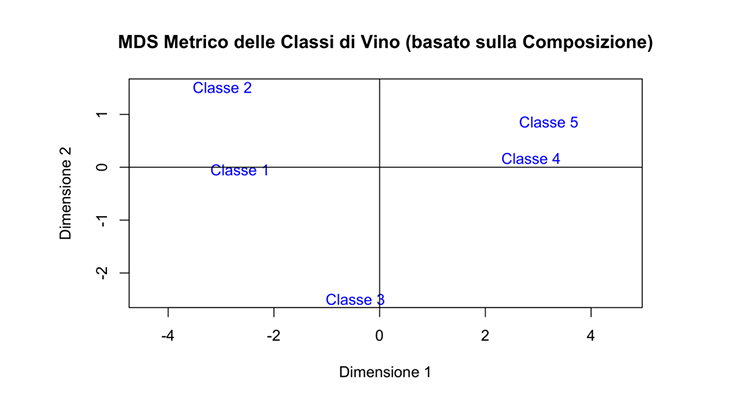
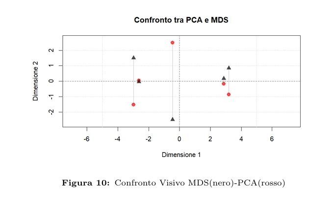
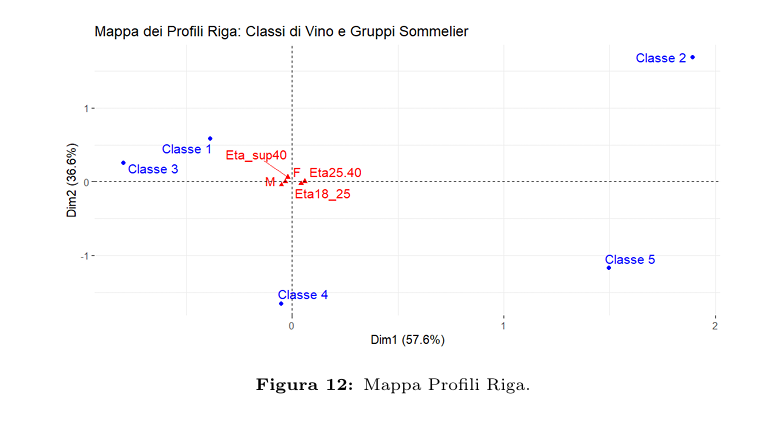

## Multivariate Mapping of Wine Classes and Sommelier Profiles (MDS, PCA and CA)

### 1. Data Preparation

An initial attempt to perform metric MDS on all individual observations required at least **five dimensions** to achieve an adequate goodness of fit, making the configuration difficult to interpret in practice.

For this reason, we opted for a more parsimonious approach based on **class centroids**:

- For each of the **5 classes**, we computed the **mean** of the 13 compositional variables → **class centroids**.
- All compositional variables were **standardised**.
- We then computed the **Euclidean distance matrix** between the centroids.

The distance matrix shows, for example:

- a **minimum distance** between **Classes 4 and 5** → very **similar chemical profiles**;
- a **maximum distance** between **Classes 2 and 5** → very **different profiles**.

### 1.1 Choice of Dimensionality

From the eigen-decomposition of the matrix associated with the distance structure, we obtained a decreasing sequence of eigenvalues. The scree plot exhibits a clear “elbow” between the **second** and the **third** dimension:

- the **first 2 dimensions** explain about **84%** of the total variance;
- the **third** dimension adds only a relatively small additional share.

We therefore adopt a **two-dimensional** representation as a good compromise between interpretability and explained variance.

### 4.3 MDS Perceptual Map (2D)

The **two-dimensional MDS map** represents the 5 class centroids, preserving as much as possible the original **Euclidean distances** between the mean chemical profiles.

Summary interpretation:

- **Classes 1 and 2**
  - Clustered on the same side of the map.
  - High mean values of **Flavanoids**, **OD280/OD315**, **Proline** → **phenol-rich**, more **structured** wines with higher complexity.
  - Interpreted as an **“Heritage”** segment: more traditional wines, aimed at enthusiasts and experts, typical of a **premium market**.

- **Classes 4 and 5**
  - Very close to each other, both graphically and in terms of numerical distances.
  - Higher **alkalinity**, lower phenolic complexity, more linear profiles.
  - Interpreted as **modern, fresh, lighter wines**, more suitable for a **mainstream** consumption context.

- **Class 3**
  - Located in a relatively **central** area of the map.
  - Chemical profile **intermediate** between the two previous groups.
  - Can be interpreted as a **bridge** between the traditional and modern worlds: a more **balanced** wine with potentially broader market appeal.

A **one-way ANOVA** on the compositional variables confirms statistically significant differences between the class means for most variables, supporting the visual separations observed in the MDS map.

---

## 2. Principal Component Analysis (PCA) on Class Centroids

PCA is applied to the **same matrix of standardised centroids** that was used for the MDS analysis.

### 2.1 Explained Variance

The summary of the explained variance shows:

- **PC1** explains approximately **66.3%** of the total variance;
- **PC2** adds about **17.8%**;
- the cumulative variance explained by the first two components is therefore about **84.2%**.

This justifies a **two-dimensional representation** in the **PC1–PC2 plane**, which can be directly compared with the MDS map.

### 2.2 PCA Biplot

The **PCA biplot** simultaneously displays:

- the **class centroids** in the plane of the first two principal components;
- the **variable vectors** (loadings), indicating the direction and strength of the contribution of each variable.

In summary:

- **PC1** is strongly associated with variables related to **phenolic richness and structure**  
  (e.g. `Total.phenols`, `Flavanoids`, `OD280/OD315`, `Proline`) and separates more **structured** wines from **simpler** ones.
- **PC2** mainly captures aspects related to **acidity/freshness** and other complementary attributes.

The configuration of the classes in the **PC1–PC2 plane** is consistent with the MDS map:

- **Classes 1–2** on one side,
- **Classes 4–5** on the opposite side,
- **Class 3** in an **intermediate** position.

---

## 3. Comparison Between MDS and PCA

To directly compare the two techniques, we constructed a plot that overlays:

- the coordinates obtained from **metric MDS**;
- the coordinates obtained from **PCA** on the centroids.

Main observations:

- The point configurations are **equivalent up to rigid transformations** (rotations/reflections).
- In the plot, the PCA map appears essentially as a **mirror image** of the MDS map with respect to an axis, but:
  - **proximity relationships** and **clusters** (1–2, 4–5, 3 isolated) are perfectly preserved.

MDS and PCA therefore reveal a **coherent structure** of the wine classes:

- they confirm the separation between **“traditional”** and **“modern”** segments;
- they confirm the **intermediate role** of **Class 3**.

---

## 4. Correspondence Analysis (CA)

Correspondence Analysis is applied to a **5×5 contingency table** crossing:

- the **5 wine classes**;
- the **5 sommelier profiles** (`F`, `M`, `Eta18_25`, `Eta25_40`, `Eta_sup40`).

From this table we compute:

- **joint relative frequencies**;
- **row profiles** (wine classes);
- **column profiles** (sommelier segments);
- **masses**, **inertias**, **quality of representation**, and **contributions** to the dimensions.

The **first two dimensions** of the CA explain the main share of the inertia, allowing for a satisfactory **two-dimensional synthesis**.

### 4.1 Row Profiles: Wine Classes

The row-principal map represents the **wine classes** in the plane of the first two dimensions:

Summary indications:

- **Classes 2 and 5** have the **largest contribution to the first dimension**, and lie furthest from the origin.
- **Class 4** contributes most to the **second dimension**.
- **Class 3** is relatively close to the origin: its profile is close to the **average profile**, confirming a more **transversal** role.
- **Class 1** has non-negligible mass but lower inertia: it contributes less to structuring the axes and lies closer to the average profile.

The following figure summarises the **class contributions** to the CA dimensions:

From this plot we can see that:

- **Dimension 1** is mainly driven by **Class 2** and **Class 5**;
- **Dimension 2** is strongly determined by **Class 4** (and, to a lesser extent, **Class 1**).

### 4.2 Column Profiles: Sommelier Segments

The column-principal map represents the **sommelier profiles** (by gender and age group):

Main observations:

- All modalities have the same **mass** (0.20), but differ in **inertia** and **quality of representation**.
- **Eta25_40**:
  - shows the **highest inertia**;
  - contributes in a dominant way to the **first dimension**;
  - is the profile **best represented** along axis 1.
- **Eta_sup40**:
  - contributes mainly to the **second dimension**, with very high quality of representation;
  - largely **structures the vertical axis**.
- **Eta18_25**:
  - has a good quality of representation;
  - contributes mostly to **dimension 1**, with a secondary role on dimension 2.
- **F** and **M**:
  - play more **complementary and less decisive** roles in determining the axes;
  - show lower inertias compared to the age-group modalities.

### 4.3 Symmetric Map: Associations Between Classes and Sommeliers

To jointly interpret the relationships between wine classes and sommelier profiles, we consider the **symmetric map**, where **row and column profiles** are displayed in the same space:

Qualitative interpretation:

- The **first dimension** opposes combinations of profiles where preferences for **Classes 2 and 5** are more pronounced (largely associated with **younger** and **middle-aged** sommelier segments) to profiles closer to the other classes.
- The **second dimension** mainly discriminates the behaviour of **over-40 sommeliers**, who tend to align more strongly with specific wine types, compared to younger groups.
- **Class 3**, located near the centre of the map, confirms a **“median”** positioning:
  - it is not strongly specialised with respect to any single sommelier segment,
  - but is instead **more evenly appreciated** across segments.

Overall, the CA reveals **non-random preference structures**, with some wine classes playing a more **characterising** role and some sommelier segments (in particular, those defined by **age**) explaining a large share of the variability in the data.
